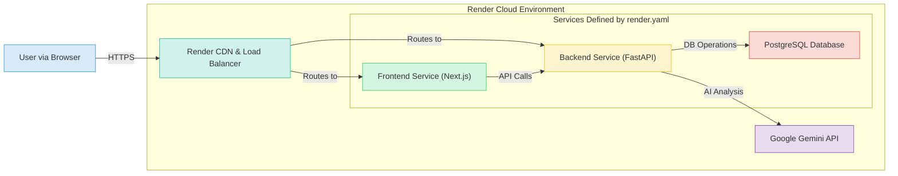

# IvanInTech: Full-Stack AI-Powered Web Application

<p align="center">
  
</p>

Welcome to **IvanInTech**, a modern, full-stack web application meticulously crafted to showcase advanced software development practices, seamless CI/CD, and the practical application of Artificial Intelligence. This project serves as a dynamic personal portfolio, an interactive blog, and a curated source for AI news and insights.

**Live web:** Deployed on [ivanintech.com](https://ivanintech.com)

## Core Philosophy & Objectives

IvanInTech is built with a focus on delivering a robust, scalable, and maintainable application while exploring and demonstrating proficiency in cutting-edge technologies.

- **Modern Development Practices:** Emphasizing clean code, modular architecture, containerization, and a streamlined developer experience. Dependency management is handled by **Poetry** via `pyproject.toml`.
- **Automated CI/CD & Deployment:** Fully automated workflows using **GitHub Actions** for testing and **Render Blueprints (`render.yaml`)** for production deployments, ensuring consistency and reliability.
- **Advanced AI Integration:** Implementing AI-driven features like automated news categorization and rating using **Google's Gemini API**, and a dynamic UI that adapts to this AI-driven data.
- **Exceptional User Experience:** Creating an intuitive, performant, and accessible interface. The frontend leverages **React Suspense** with skeleton loaders for an instantaneous feel, and dynamic grid layouts to highlight important content.

## Technology Stack

This project leverages a powerful and modern technology stack, containerized with Docker for local development and deployed seamlessly to the cloud.

### Key Technologies:

<p align="left">
  <a href="https://www.python.org" target="_blank"></a>
  <a href="https://fastapi.tiangolo.com/" target="_blank"></a>
  <a href="https://python-poetry.org/" target="_blank"></a>
  <a href="https://www.postgresql.org" target="_blank"></a>
  <a href="https://alembic.sqlalchemy.org/" target="_blank"></a>
  <br>
  <a href="https://nextjs.org/" target="_blank"></a>
  <a href="https://react.dev/" target="_blank"></a>
  <a href="https://www.typescriptlang.org/" target="_blank"></a>
  <a href="https://ui.shadcn.com/" target="_blank"></a>
  <a href="https://tailwindcss.com/" target="_blank"></a>
  <br>
  <a href="https://www.docker.com/" target="_blank"></a>
  <a href="https://render.com" target="_blank"></a>
  <a href="https://github.com/features/actions" target="_blank"></a>
  <a href="https://cloud.google.com/vertex-ai/docs/generative-ai/model-reference/gemini" target="_blank"></a>
</p>

### Backend: Python & FastAPI

The backend is built with **FastAPI**, leveraging Python's ecosystem for high performance and developer efficiency.

- **Modern Dependency Management:** Uses **Poetry** and `pyproject.toml` for clear, reproducible dependency management.
- **Async Support:** Built on Starlette and Uvicorn for non-blocking I/O operations.
- **SQLModel ORM:** Combines SQLAlchemy's power with Pydantic's validation.
- **Alembic Migrations:** Manages database schema evolution automatically on deployment.
- **AI Integration:** Utilizes Google's Gemini API (`gemini-1.5-flash`) for intelligent content analysis, rating, and categorization.

### Frontend: Next.js (React) & TypeScript

- **Optimized Performance:** Leverages Next.js features like Server Components and streaming UI with **React Suspense** and **Skeleton Loaders**.
- **Dynamic & Responsive UI:** Built with React and styled with **Tailwind CSS** via **shadcn/ui**. Features adaptive grid layouts that highlight AI-rated content.
- **Type Safety:** TypeScript across the frontend ensures robustness.

### DevOps & Infrastructure

- **Containerization:** Docker and Docker Compose for local development.
- **Cloud Deployment:** Hosted on **Render**, with infrastructure defined as code via `render.yaml`.
- **Database:** PostgreSQL on Render for production, SQLite for local development.
- **CI/CD:** GitHub Actions for automated testing, and Render Blueprints for continuous deployment from the `main` branch.

## Architecture & Deployment

The application follows a modern client-server architecture. For production, it is deployed on Render as three distinct services defined in a `render.yaml` blueprint, ensuring a reliable and scalable setup.



## Key Features

✨ **AI-Powered News Feed:** A curated news stream where articles are **filtered, rated, and categorized by Google's Gemini API**. The UI dynamically adjusts, showcasing higher-rated articles more prominently in a responsive grid.

⚡️ **Optimized User Experience:** The homepage utilizes **React Suspense** and **Skeleton Loaders** to provide an instantaneous loading experience, streaming in dynamic content like projects and blog posts without blocking the UI.

📝 **Blog Platform:** Explore and filter engaging blog posts with rich content and tag-based filtering.

🖼️ **Dynamic Portfolio Showcase:** Elegantly display projects with details, images, and video URLs. Features a smart "Featured Projects" section and engaging hover effects.

🔐 **Secure User Authentication:** Robust registration, login, and session management powered by JWT tokens.

👑 **Role-Based Access Control (RBAC):** Differentiates features for regular users and administrators.

## Deployment with Render

This project is configured for seamless deployment to **Render** using a **Blueprint (`render.yaml`)**. This "Infrastructure as Code" approach automates the setup of all necessary services.

**How it works:**

1.  **Connect Repo:** Connect your GitHub repository to Render and point it to this blueprint.
2.  **Automatic Setup:** Render reads `render.yaml` and automatically provisions:
    - A **PostgreSQL** database.
    - A **Python/FastAPI** web service for the backend.
    - A **Node/Next.js** web service for the frontend.
3.  **Build & Deploy:** Render installs dependencies (using `pyproject.toml` for the backend), runs the database migrations (`alembic upgrade head`), and starts the services.
4.  **Environment Variables:** Critical secrets (like API keys) are managed securely using a **Secret Group** in the Render dashboard, which you must create and populate.

This setup ensures that every push to the `main` branch can trigger a new, consistent deployment to production.

## Getting Started

Setting up IvanInTech locally is streamlined with Docker.

### Prerequisites

- [Docker](https://www.docker.com/get-started) & [Docker Compose](https://docs.docker.com/compose/install/)
- [Git](https://git-scm.com/downloads)

### Installation & Running

1.  **Clone the Repository:**
    ```bash
    git clone https://github.com/ivanmdev/ivanintech.git # Replace with your repo URL
    cd ivanintech
    ```

2.  **Configure Environment Variables:**
    - **Root `.env`:** Copy `.env.example` to `.env` for `POSTGRES_PASSWORD`.
    - **Backend (`backend/.env`):** Copy `backend/.env.example` to `backend/.env`. Fill in your `SECRET_KEY`, `FIRST_SUPERUSER` details, and API keys.
    - **Frontend (`frontend/.env.local`):** Copy `frontend/.env.local.example` to `frontend/.env.local`. `NEXT_PUBLIC_API_BASE_URL` is typically `http://localhost:8000` for local Docker setup.

3.  **Launch with Docker Compose:**
    The `docker compose watch` command enables hot-reloading for both frontend and backend development.
    ```bash
    docker compose watch
    ```
    - Frontend: `http://localhost:3000`
    - Backend API: `http://localhost:8000`

## Development Insights

### Backend (`backend/`)
- Dependencies are managed by **Poetry** in `pyproject.toml`.
- API routes are in `app/api/routes/`.
- Data models (SQLModel) are in `app/db/models/`.
- Pydantic schemas are in `app/schemas/`.
- Business logic and AI service integrations are in `app/services/`.
- Run tests with `pytest`.

### Database Migrations (`backend/`)
- When SQLModel definitions in `app/db/models/` change, generate new Alembic migrations:
  ```bash
  # From backend/ directory, with .venv active or via Docker exec:
  alembic revision -m "Your descriptive migration message" --autogenerate
  ```
- Apply migrations (Docker Compose handles this on startup, or manually):
  ```bash
  alembic upgrade head
  ```

## Author & Contact

Developed by **Iván Castro Martínez**.

- **GitHub Profile:** [ivanmdev](https://github.com/ivanintech)
- **LinkedIn:** [Iván Castro Martínez](https://www.linkedin.com/in/iv%C3%A1n-castro-mart%C3%ADnez-293b9414a/)

Feedback, feature requests, and contributions are welcome!

## License

The IvanInTech project code is proprietary.
This project was initially based on the **Full Stack FastAPI Template**, which is licensed under the MIT license. Aspects of that original template structure may still be present.
