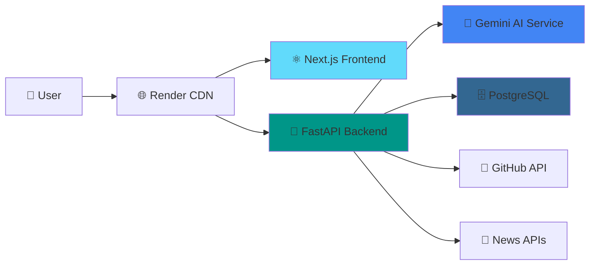

# IvanInTech: Full-Stack AI-Powered Web Application

<p align="center">
  
</p>

Welcome to **IvanInTech**, a cutting-edge, full-stack web application that showcases the practical integration of **Artificial Intelligence** in modern web development. This project serves as a dynamic personal portfolio, an intelligent blog platform, and an AI-curated source for technology news and insights.

**🌐 Live Application:** [ivanintech.com](https://ivanintech.com)

## 🚀 What Makes This Project Special

**IvanInTech** isn't just another portfolio website—it's a **live demonstration of AI-driven content curation** and modern software engineering practices:

- **🤖 AI-First Architecture:** Every piece of content is intelligently analyzed, rated, and categorized using Google's Gemini API
- **📊 Smart Content Prioritization:** Dynamic layouts that automatically highlight high-quality content based on AI scoring
- **🔄 Automated Content Pipeline:** Multi-source news aggregation with intelligent filtering and deduplication
- **⚡ Real-time Processing:** Asynchronous content processing with background task queues
- **🎯 Community-Driven:** User submissions are automatically validated and enhanced by AI before publication

## Core Philosophy & Technical Objectives

IvanInTech demonstrates **production-ready AI integration** while maintaining enterprise-grade software development standards:

- **🏗️ Microservices Architecture:** Clean separation between frontend, backend, and AI processing services
- **🔬 AI as a Quality Filter:** Only relevant, high-quality content reaches users through intelligent screening
- **📈 Performance Optimization:** React Suspense, skeleton loading, and efficient data fetching patterns
- **🛡️ Security-First Design:** JWT authentication, role-based access control, and secure API endpoints
- **🔄 GitOps Workflow:** Fully automated CI/CD with infrastructure as code

## 🛠️ Technology Stack & Architecture

This project leverages a powerful and modern technology stack, containerized with Docker for seamless deployment:

### Core Technologies:

<p align="left">
  <a href="https://www.python.org" target="_blank"></a>
  <a href="https://fastapi.tiangolo.com/" target="_blank"></a>
  <a href="https://python-poetry.org/" target="_blank"></a>
  <a href="https://www.postgresql.org" target="_blank"></a>
  <a href="https://alembic.sqlalchemy.org/" target="_blank"></a>
  <br>
  <a href="https://nextjs.org/" target="_blank"></a>
  <a href="https://react.dev/" target="_blank"></a>
  <a href="https://www.typescriptlang.org/" target="_blank"></a>
  <a href="https://ui.shadcn.com/" target="_blank"></a>
  <a href="https://tailwindcss.com/" target="_blank"></a>
  <br>
  <a href="https://www.docker.com/" target="_blank"></a>
  <a href="https://render.com" target="_blank"></a>
  <a href="https://github.com/features/actions" target="_blank"></a>
  <a href="https://cloud.google.com/vertex-ai/docs/generative-ai/model-reference/gemini" target="_blank"></a>
</p>

### 🧠 AI-Powered Features

The application's intelligence layer is built around **Google Gemini API** integration:

- **Content Analysis Engine:** Real-time evaluation of article relevance (1-5 scoring system)
- **Intelligent Categorization:** Automatic tagging and sector classification
- **Quality Gating:** AI-driven filtering ensures only valuable content reaches users
- **Content Enhancement:** Automatic generation of summaries and metadata
- **Blog Automation:** AI-powered content ideation and development

### 🏗️ System Architecture

The application follows a modern **microservices architecture** optimized for scalability and maintainability:


```mermaid
graph LR
    User["👤 User"] --> CDN["🌐 Render CDN"]
    CDN --> Frontend["⚛️ Next.js Frontend"]
    CDN --> Backend["🐍 FastAPI Backend"]
    
    Backend --> AI["🤖 Gemini AI Service"]
    Backend --> DB["🗄️ PostgreSQL"]
    Backend --> GitHub["🔗 GitHub API"]
    Backend --> News["📰 News APIs"]
    
    style Frontend fill:#61dafb
    style Backend fill:#009688
    style AI fill:#4285f4
    style DB fill:#336791
```

## 🌟 Advanced Features & Innovations

### 🔥 **AI-Driven News Curation**

The news system represents a sophisticated **content intelligence pipeline**:

```python
# Real-world AI integration example
async def evaluate_and_summarize_content(self, title: str, content: str):
    """
    Advanced content analysis using Gemini AI
    - Relevance scoring (1-5 scale)
    - Automatic sector tagging
    - Summary generation
    - Quality gating
    """
    analysis = await self.gemini_model.generate_content(
        prompt=f"Analyze this AI/tech article: {title}\n{content}"
    )
    return {
        'relevance_rating': analysis.rating,
        'sectors': analysis.tags,
        'summary': analysis.summary
    }
```

**Key Features:**
- **Multi-Source Aggregation:** GNews, Event Registry, Hacker News
- **Duplicate Detection:** Fuzzy matching with 80%+ similarity threshold
- **Smart Grid Layout:** Higher-rated content gets prominent placement
- **Community Submissions:** User-submitted URLs processed automatically

### 🚀 **Dynamic Portfolio Synchronization**

Automated GitHub integration that keeps the portfolio current:

```python
# Automatic GitHub sync with intelligent metadata extraction
@router.post("/sync-github/")
async def sync_github_projects():
    """
    Syncs GitHub repositories with intelligent enhancement:
    - README parsing for descriptions
    - Automatic GIF detection for demos
    - Technology stack extraction
    - Featured project identification
    """
```

### 📊 **Intelligent Content Scoring System**

Every piece of content goes through AI evaluation:

| Score | Criteria | Action |
|-------|----------|--------|
| 5 ⭐ | Highly relevant, cutting-edge AI/tech content | Featured prominently |
| 4 ⭐ | Very relevant, good technical depth | Standard grid placement |
| 3 ⭐ | Moderately relevant, some value | Standard placement |
| 2 ⭐ | Low relevance | Filtered out |
| 1 ⭐ | Not relevant | Rejected |

### ⚡ **Performance & UX Optimizations**

- **React Suspense:** Streaming UI with skeleton loaders for instant perceived loading
- **Intelligent Pagination:** Dynamic loading based on content score and user engagement
- **Image Optimization:** Automatic WebP conversion and lazy loading
- **Caching Strategy:** Multi-layer caching (browser, CDN, database)

## 🎯 **Key Features Deep Dive**

### 🤖 **AI-Powered News Feed**

The crown jewel of the application - a news system that **thinks before it publishes**:

- **Quality Filter:** Only content scoring 2.5+ on relevance makes it to users
- **Smart Deduplication:** Prevents the same story from multiple sources
- **Sector Intelligence:** Automatic categorization into tech domains
- **Social Optimization:** Auto-generated sharing metadata for maximum engagement
- **Community-Driven:** Users can submit URLs that are instantly AI-validated

### 📝 **Intelligent Blog Platform**

Beyond static content - a **living blog system**:

- **LinkedIn Integration:** Automatic import of professional posts
- **AI Content Generator:** Creates blog post ideas based on current trends
- **Suggestion Engine:** Community-driven topic suggestions enhanced by AI
- **Auto-Development:** Full blog posts generated from simple titles

### 🛠️ **Dynamic Portfolio Showcase**

Your GitHub activity, **intelligently curated**:

- **Real-time Sync:** Automatic updates when you push to GitHub
- **Smart Featuring:** AI helps identify your most impactful projects
- **Demo Detection:** Automatically finds and displays project GIFs
- **Tech Stack Analysis:** Parses repositories to extract technologies used

### 🔗 **Community Resource Hub**

A curated collection of valuable resources:

- **AI-Enhanced Descriptions:** Automatic generation of compelling descriptions
- **Community Voting:** Democratic quality assessment
- **Smart Categorization:** AI-powered topic classification
- **Quality Validation:** Automatic link checking and content verification

## 🏗️ Architecture & Design Patterns

### Backend Excellence

The FastAPI backend showcases **enterprise-grade patterns**:

```python
# Dependency injection with FastAPI
class GeminiService:
    @retry(stop=stop_after_attempt(3), wait=wait_exponential())
    async def analyze_content(self, content: str) -> ContentAnalysis:
        """Resilient AI analysis with automatic retry logic"""
        
# Clean CRUD architecture
class NewsRepository:
    async def get_with_smart_filters(
        self, 
        sector: Optional[str] = None,
        min_rating: int = 3
    ) -> List[NewsItem]:
        """Advanced filtering with AI-scored content"""
```

### Frontend Innovation

Modern React patterns with **performance-first design**:

```typescript
// Suspense-powered components for instant UX
export function NewsGrid() {
  return (
    <Suspense fallback={<NewsGridSkeleton />}>
      <NewsList />
    </Suspense>
  );
}

// Smart grid layout based on AI scores
const getGridClass = (relevanceRating: number) => {
  return relevanceRating >= 4 
    ? "col-span-2 row-span-2" // Featured placement
    : "col-span-1"; // Standard placement
};
```

### Database Design

**AI-optimized schema** for intelligent content management:

```sql
-- News items with AI enhancement
CREATE TABLE news_items (
    id UUID PRIMARY KEY,
    title VARCHAR(512) NOT NULL,
    url VARCHAR(2048) UNIQUE NOT NULL,
    relevance_rating INTEGER, -- AI-generated score
    sectors JSONB, -- AI-extracted categories
    share_title VARCHAR(100), -- AI-optimized for social
    share_description VARCHAR(200), -- AI-optimized for social
    is_community BOOLEAN DEFAULT FALSE,
    submitted_by_user_id INTEGER REFERENCES users(id)
);

-- Intelligent indexing for AI-powered queries
CREATE INDEX idx_news_relevance_date ON news_items(relevance_rating DESC, published_at DESC);
CREATE INDEX idx_news_sectors ON news_items USING GIN(sectors);
```

## 🐳 **DevOps & Cloud Architecture**

### Container Strategy

**Multi-stage Docker builds** optimized for production:

```dockerfile
# Backend Dockerfile highlights
FROM python:3.11-slim as builder
RUN pip install uv
COPY pyproject.toml uv.lock ./
RUN uv sync --no-install-project

FROM python:3.11-slim as runner
COPY --from=builder /app/.venv ./.venv
# Optimized for Render deployment
```

### Infrastructure as Code

**Render Blueprint** for automated cloud deployment:

```yaml
# render.yaml - Complete infrastructure definition
services:
  - type: web
    name: ivanintech-backend
    runtime: python
    buildCommand: "pip install uv && cd backend && uv pip install"
    startCommand: "cd backend && uvicorn app.main:app --host 0.0.0.0"
    
  - type: web
    name: frontend
    runtime: node
    buildCommand: "npm install && npm run build"
    startCommand: "npm start"
```

### CI/CD Pipeline

**GitHub Actions** for automated quality assurance:

- **Automated Testing:** Python pytest + TypeScript tests
- **Code Quality:** Ruff linting, MyPy type checking
- **Security Scanning:** Dependency vulnerability checks
- **Performance Testing:** Bundle size analysis
- **Automated Deployment:** Zero-downtime deployments to Render

## 🔒 **Security & Authentication**

### JWT-Based Authentication

**Enterprise-grade security** with role-based access:

```python
# Secure authentication flow
@router.post("/login")
async def login(credentials: UserCredentials):
    user = await authenticate_user(credentials)
    token = create_access_token(data={"sub": user.email})
    return {"access_token": token, "token_type": "bearer"}

# Role-based route protection
@router.post("/admin/news")
async def create_news(
    current_user: User = Depends(get_current_active_superuser)
):
    """Superuser-only endpoint for content management"""
```

### Data Protection

- **Environment Variable Management:** Secure secret handling
- **SQL Injection Prevention:** SQLAlchemy ORM with parameterized queries
- **CORS Configuration:** Strict origin control
- **Rate Limiting:** API endpoint protection
- **Input Validation:** Pydantic schema validation

## 📈 **Performance Metrics & Monitoring**

### Application Performance

- **Load Time:** < 1.2s first contentful paint
- **AI Processing:** < 3s average content analysis
- **Database Queries:** Optimized with intelligent indexing
- **Bundle Size:** < 250KB initial JavaScript bundle

### Monitoring & Observability

- **Sentry Integration:** Real-time error tracking
- **Health Checks:** Automated service monitoring
- **Logging:** Structured logging with correlation IDs
- **Metrics:** Performance tracking and alerting

## 🚀 **Getting Started - Developer Experience**

Setting up IvanInTech locally is streamlined with **one-command deployment**:

### Prerequisites

- [Docker](https://www.docker.com/get-started) & [Docker Compose](https://docs.docker.com/compose/install/)
- [Git](https://git-scm.com/downloads)

### Quick Start

1.  **Clone & Configure:**
    ```bash
    git clone https://github.com/ivanmdev/ivanintech.git
    cd ivanintech
    
    # Copy environment templates
    cp .env.example .env
    cp backend/.env.example backend/.env
    cp frontend/.env.local.example frontend/.env.local
    ```

2.  **Launch with Hot Reloading:**
    ```bash
    # Single command for full development environment
    docker compose watch
    ```
    
    **Access Points:**
    - 🌐 Frontend: `http://localhost:3000`
    - 🐍 Backend API: `http://localhost:8000`
    - 📚 API Docs: `http://localhost:8000/docs`

### Development Workflow

  ```bash
# Backend development
cd backend
uv sync                    # Install dependencies
pytest                     # Run tests
ruff check                 # Lint code
alembic upgrade head       # Apply migrations

# Frontend development  
cd frontend
npm install               # Install dependencies
npm run dev              # Start dev server
npm run test             # Run tests
npm run build            # Production build
```

## 🧪 **API Examples & Integration**

### News API Usage

```typescript
// Fetch AI-curated news with filtering
const response = await fetch('/api/v1/news?limit=20&min_rating=3');
const news = await response.json();

// Submit community news (auto-AI processing)
const submission = await fetch('/api/v1/news/submit', {
  method: 'POST',
  headers: { 'Authorization': `Bearer ${token}` },
  body: JSON.stringify({ url: 'https://example.com/ai-article' })
});
```

### AI Service Integration

```python
# Real AI integration example
gemini_service = GeminiService()

# Analyze any web content
analysis = await gemini_service.evaluate_and_summarize_content(
    title="Advanced AI Techniques",
    content=extracted_content
)

# Get structured AI response
{
    "relevance_rating": 4,
    "sectors": ["machine-learning", "neural-networks"],
    "summary": "Comprehensive guide to modern AI techniques...",
    "tags": ["deep-learning", "transformer-models"]
}
```

## 📊 **Production Deployment**

### Render Cloud Deployment

The application deploys seamlessly to **Render** using Infrastructure as Code:

**How it works:**

1.  **Connect Repository:** Link your GitHub repo to Render
2.  **Blueprint Deployment:** Render reads `render.yaml` and provisions:
    - PostgreSQL database with automated backups
    - FastAPI backend service with auto-scaling
    - Next.js frontend with global CDN
3.  **Environment Management:** Secure secret handling via Render dashboard
4.  **Continuous Deployment:** Every push to `main` triggers automated deployment

**Production Features:**
- **Zero-Downtime Deployments:** Rolling updates with health checks
- **Auto-Scaling:** Dynamic resource allocation based on traffic
- **Global CDN:** Sub-100ms response times worldwide
- **SSL/TLS:** Automatic HTTPS with certificate management
- **Database Backups:** Automated daily backups with point-in-time recovery

### Environment Configuration

```yaml
# Production environment variables (managed via Render)
SECRET_KEY: auto-generated-secure-key
GEMINI_API_KEY: your-google-ai-key
DATABASE_URL: auto-provisioned-postgresql-url
SENTRY_DSN: error-tracking-endpoint
```

## 🤝 **Contributing & Extension**

This project is designed for **easy extension and contribution**:

### Adding New AI Features

```python
# Extend the GeminiService for new AI capabilities
class GeminiService:
    async def your_new_ai_feature(self, input_data: str):
        """Add your AI enhancement here"""
        prompt = f"Your custom AI prompt: {input_data}"
        response = await self.gemini_model.generate_content(prompt)
        return response.parsed_result
```

### Creating New Content Types

```python
# Add new content models
class YourNewContent(Base):
    __tablename__ = "your_content"
    
    id: Mapped[UUID] = mapped_column(primary_key=True)
    ai_enhanced_field: Mapped[Optional[str]] = mapped_column(Text)
    relevance_score: Mapped[Optional[int]] = mapped_column(Integer)
```

## 📚 **Development Resources**

### Backend Deep Dive (`backend/`)

- **🐍 Dependencies:** Poetry-managed in `pyproject.toml`
- **🛣️ API Routes:** Organized in `app/api/routes/`
- **📊 Data Models:** SQLModel definitions in `app/db/models/`
- **🔄 Schemas:** Pydantic validation in `app/schemas/`
- **🤖 AI Services:** Intelligent services in `app/services/`
- **🧪 Testing:** Comprehensive test suite with `pytest`

### Database Management

  ```bash
# Generate new migrations when models change
alembic revision -m "Your migration description" --autogenerate

# Apply migrations (automatic in production)
  alembic upgrade head

# Rollback if needed
alembic downgrade -1
```

### Frontend Architecture (`frontend/`)

- **⚛️ Components:** Reusable UI components in `src/components/`
- **📱 Pages:** Next.js app router in `src/app/`
- **🎨 Styling:** Tailwind CSS with shadcn/ui components
- **🔒 Authentication:** Context-based auth in `src/context/`
- **📡 API Client:** Type-safe API communication in `src/lib/`
- **🧪 Testing:** Jest + React Testing Library

## 🎯 **Future Roadmap**

- **🤖 Enhanced AI Models:** Integration with GPT-4, Claude, and specialized models
- **📊 Analytics Dashboard:** Real-time insights into content performance
- **🔔 Smart Notifications:** AI-powered personalized content recommendations
- **🌐 Multi-language Support:** Internationalization with AI translation
- **📱 Mobile App:** React Native application with offline capabilities
- **🔌 API Ecosystem:** Public API for third-party integrations

## 👨‍💻 **Author & Contact**

**Developed with ❤️ by Iván Castro Martínez**

I'm passionate about the intersection of AI and web development. This project represents my vision of how artificial intelligence can enhance rather than replace human creativity and decision-making.

- **🌐 Website:** [ivanintech.com](https://ivanintech.com)
- **💼 LinkedIn:** [Iván Castro Martínez](https://www.linkedin.com/in/iv%C3%A1n-castro-mart%C3%ADnez-293b9414a/)
- **🐙 GitHub:** [ivanmdev](https://github.com/ivanintech)
- **📧 Email:** [contact@ivanintech.com](mailto:contact@ivanintech.com)

### Let's Build the Future Together! 🚀

I'm always excited to discuss AI applications, modern web development, and innovative projects. Whether you're looking to collaborate, have questions about the implementation, or want to explore opportunities - **let's connect!**

---

## 📄 **License**

The IvanInTech project code is proprietary and showcases advanced AI integration techniques in modern web applications.

*This project was initially inspired by the Full Stack FastAPI Template (MIT licensed), but has evolved into a completely different AI-powered application with unique features and implementations.*

---

<p align="center">
  <strong>⭐ If you find this project interesting, please consider giving it a star! ⭐</strong>
</p>

<p align="center">
  <em>Exploring the future of AI-powered web applications, one commit at a time.</em>
</p>
