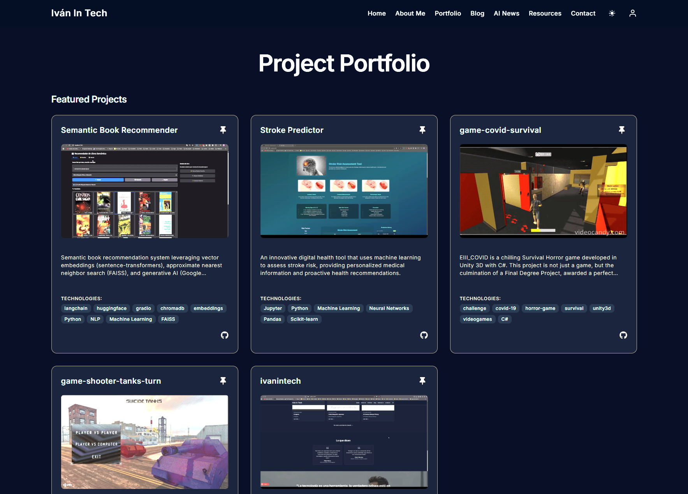

# IvanInTech: Full-Stack AI-Powered Web Application

<p align="center">
  
</p>

Welcome to **IvanInTech**, a modern, full-stack web application meticulously crafted to showcase advanced software development practices, seamless front-to-back integration, and the practical application of Artificial Intelligence. This project serves as a dynamic personal portfolio, an interactive blog platform, now fully available in English and architected for future languages, and a curated source for AI news and insights.

**Live Demo:** [ivanintech.com](https://www.ivanintech.com)

## Core Philosophy & Objectives

IvanInTech is built with a focus on delivering a robust, scalable, and maintainable application while exploring and demonstrating proficiency in cutting-edge technologies. Key objectives include:

- **Showcasing Full-Stack Expertise:** Demonstrating end-to-end development capabilities from database design to UI/UX implementation.
- **Modern Development Practices:** Emphasizing clean code, modular architecture, containerization, and CI/CD.
- **Advanced AI Integration:** Implementing AI-driven features, including automated news categorization using Google's Gemini API and exploring further AI applications.
- **Exceptional User & Developer Experience:** Creating an intuitive, performant, and accessible interface for users (now fully in English), and a streamlined, efficient environment for developers.
- **Internationalization:** The entire application, from the user interface to backend logs and code comments, has been fully translated to English, with a robust structure in place to support additional languages in the future.

## Technology Stack

This project leverages a powerful and modern technology stack, containerized with Docker for consistency and ease of deployment.

### Key Technologies:

<p align="left">
  <a href="https://www.python.org" target="_blank"></a>
  <a href="https://fastapi.tiangolo.com/" target="_blank"></a>
  <a href="https://sqlmodel.tiangolo.com/" target="_blank"></a>
  <a href="https://www.postgresql.org" target="_blank"></a>
  <a href="https://alembic.sqlalchemy.org/" target="_blank"></a>
  <br>
  <a href="https://nextjs.org/" target="_blank"></a>
  <a href="https://react.dev/" target="_blank"></a>
  <a href="https://www.typescriptlang.org/" target="_blank"></a>
  <a href="https://ui.shadcn.com/" target="_blank"></a>
  <a href="https://tailwindcss.com/" target="_blank"></a>
  <br>
  <a href="https://www.docker.com/" target="_blank"></a>
  <a href="https://docs.docker.com/compose/" target="_blank"></a>
  <a href="https://traefik.io/traefik/" target="_blank"></a>
  <a href="https://cloud.google.com/vertex-ai/docs/generative-ai/model-reference/gemini" target="_blank"></a>
  <a href="https://github.com/features/actions" target="_blank"></a>
</p>

### Backend: Python & FastAPI
The backend is built with **FastAPI**, leveraging Python's ecosystem for high performance and developer efficiency.
- **Async Support:** Built on Starlette and Uvicorn for non-blocking I/O operations.
- **Pydantic Validation:** Ensures data integrity and provides clear, automatic API documentation.
- **SQLModel ORM:** Combines SQLAlchemy's power with Pydantic's validation for database interactions.
- **Alembic Migrations:** Manages database schema evolution.
- **JWT Authentication:** Secures API endpoints.
- **AI Integration:** Utilizes Google's Gemini API (specifically `gemini-1.5-flash`) for tasks like news content categorization.

### Frontend: Next.js (React) & TypeScript
A responsive and interactive frontend experience is delivered using **Next.js** and **TypeScript**.
- **Optimized Performance:** Leverages Next.js features (SSR, SSG, Image Optimization).
- **Rich User Interface:** Built with React and styled using **Tailwind CSS** via **shadcn/ui**. Enhanced with subtle hover effects (e.g., zoom on project cards).
- **Type Safety:** TypeScript across the frontend ensures robustness.
- **Internationalization:** The entire application is now fully in English, with a structure supporting future languages.

### DevOps & Infrastructure
- **Containerization:** Docker and Docker Compose.
- **Reverse Proxy:** Traefik for request handling and SSL.
- **CI/CD:** GitHub Actions.
- **Database:** PostgreSQL (production) and SQLite (development).

## Architecture Overview

The application follows a modern client-server architecture, containerized for portability and scalability.


**Flow:**
1.  **User Interaction:** Users access the application via a web browser, interacting with the Next.js frontend (now fully in English).
2.  **Request Routing:** Traefik handles incoming HTTPS requests, routing them to either the Frontend or Backend Docker containers.
3.  **Frontend Logic:** Next.js serves pages, manages UI state, and makes API calls to the backend using a typed client.
4.  **Backend Processing:** FastAPI processes requests, handles business logic (including AI service calls), authenticates users, and interacts with the database.
5.  **Data Persistence:** SQLModel interfaces with PostgreSQL (production) or SQLite (development) for data storage and retrieval. Alembic manages schema migrations.
6.  **AI Augmentation:** Services like Google Gemini API are used for features such as intelligent news categorization.

## Key Features

✨ **AI-Powered News Feed:** Stay updated with a curated stream of news articles from the world of Artificial Intelligence, automatically categorized by topic/sector using **Google's Gemini API**.

📝 **Blog Platform:** Create, explore, and filter engaging blog posts. The platform now operates entirely in English, supporting rich content, embedded media, and tag-based filtering.

🖼️ **Dynamic Portfolio Showcase:** Elegantly display projects with details, images, video URLs, and technologies. Features a smart "Featured Projects" section based on video content or admin selection, with engaging hover zoom effects on project cards.

🔐 **Secure User Authentication:** Robust registration, login, and session management powered by JWT tokens.

👑 **Role-Based Access Control (RBAC):** Differentiates features for regular users and administrators (e.g., content creation tools, project featuring).

📱 **Responsive & Adaptive Design:** Seamless experience across desktop, tablet, and mobile devices.

🌙 **Dark Mode:** Comfortable dark theme for low-light viewing.

🌐 **Internationalization (I18n):** Completed a comprehensive, full-stack translation to English (UI, API responses, logs, and code comments), with an architecture ready for future languages.

🛠️ **Intuitive Admin Tools:** (Evolving) Manage users, blog posts, and other application content.

## Deep Dive: AI-Powered News Categorization

A Python script (`backend/app/scripts/auto_tag_news_sectors.py`) leverages the Google Gemini API to automatically categorize news items that lack sector information.

**Process Flow:**

This script enhances data quality and enables better content filtering and discovery for users. It includes error handling and respects API rate limits by pausing between requests.

## Deep Dive: Portfolio Curation

The portfolio showcases projects with a distinction between "Featured Projects" and "More Projects".
-   **Featured Criteria:** A project is considered "Featured" if:
    1.  It has a `videoUrl` specified.
    2.  An administrator has manually marked it as `is_featured` using a dedicated UI toggle.
-   **Homepage Display:** The homepage dynamically shows a subset (e.g., top 2) of these truly "Featured Projects".
-   **Admin Control:** Superusers can easily toggle the `is_featured` status of any project.

## Current Status & Roadmap

IvanInTech is an actively evolving project. Recent major enhancements include:
- **Full-Stack Translation:** Completed a comprehensive translation of the entire application, including frontend UI, backend APIs, logs, and all code comments, to English.
- **AI-Driven News Tagging:** Implementation of a script using the Gemini API to automatically categorize news articles by sector.
- **Refined Portfolio Logic:** Enhanced the portfolio display with a "Featured" section and improved UI effects.
- **Extensive Codebase Cleanup:** Performed significant refactoring and cleanup across both frontend and backend code.

**Planned Enhancements:**
- Advanced AI-driven content suggestions or summaries.
- More sophisticated admin dashboard functionalities with detailed analytics.
- Integration of further external APIs for richer, diverse content streams.
- Automated synchronization of GitHub pinned repositories with portfolio `is_featured` status.
- Comprehensive end-to-end testing and continuous performance optimization.
- Expansion of I18n to include Spanish.

## Screenshots

**1. Modern Login Page (Now in English):**
   

**2. Dynamic Blog Page with Filters & Embedded Content (English UI):**
   

**3. AI News Aggregation (Sectors potentially auto-tagged):**
   

**4. Portfolio Page with "Featured" and "More Projects" Sections (English UI):**
   

**5. "About Me" Page (English UI):**
   

### Interactive API Documentation

FastAPI automatically generates interactive API documentation (Swagger UI and ReDoc). Once the backend is running, access it at:
- Swagger UI: `http://localhost:8000/docs`
- ReDoc: `http://localhost:8000/redoc`

## Getting Started

Setting up IvanInTech locally is streamlined with Docker.

### Prerequisites

-   [Docker](https://www.docker.com/get-started) & [Docker Compose](https://docs.docker.com/compose/install/)
-   [Git](https://git-scm.com/downloads)
-   A modern web browser

### Installation & Running

1.  **Clone the Repository:**
```bash
    git clone https://github.com/ivanmdev/ivanintech.git # Replace with your repo URL
    cd ivanintech
```

2.  **Configure Environment Variables:**
    Essential for application behavior and security. `.env` files are used for this and should **not** be committed to version control.
    -   **Root `.env`:** Copy `.env.example` to `.env` in the project root. This primarily contains `POSTGRES_PASSWORD`.
```bash
        cp .env.example .env
        ```
    -   **Backend (`backend/.env`):** Copy `backend/.env.example` to `backend/.env`. Key variables:
        - `PROJECT_NAME`
        - `FIRST_SUPERUSER`, `FIRST_SUPERUSER_PASSWORD`
        - `SECRET_KEY` (Generate a strong one: `python -c "import secrets; print(secrets.token_urlsafe(32))"`)
        - `GEMINI_API_KEY` (Your Google Gemini API Key, required for news tagging script)
```bash
        cp backend/.env.example backend/.env
        # Edit backend/.env with your actual values
```
    -   **Frontend (`frontend/.env.local`):** Copy `frontend/.env.local.example` to `frontend/.env.local`. Set `NEXT_PUBLIC_API_BASE_URL` (usually `http://localhost:8000` for local Docker setup).
```bash
        cp frontend/.env.local.example frontend/.env.local
```

3.  **Launch with Docker Compose:**
    From the project root, the `docker compose watch` command builds images, starts all services (backend, frontend, database, Traefik), and enables hot-reloading for both frontend and backend development.
```bash
    docker compose watch
    ```
    -   Frontend: Access at `http://localhost:3000` (or your configured port).
    -   Backend API: Access at `http://localhost:8000`.

4.  **Initial Superuser & Database Setup:**
    -   On the first run, Alembic migrations will automatically set up the database schema.
    -   The `FIRST_SUPERUSER` and `FIRST_SUPERUSER_PASSWORD` from `backend/.env` will create an initial admin account.

## Development Insights

### Backend (`backend/`)
- API routes in `app/api/routes/`.
- Data models (SQLModel) in `app/db/models/`.
- Pydantic schemas in `app/schemas/`.
- Business logic and AI service integrations in `app/services/`.
- Utility scripts (like news tagging) in `app/scripts/`.
- Run tests with `pytest`.

### Frontend (`frontend/`)
- Pages (routes) in `src/app/`.
- Reusable UI components in `src/components/`.
- Context and custom hooks in `src/context/` and `src/lib/` (or `src/hooks/`).
- Global types in `src/types/`.

### Database Migrations (`backend/`)
- When SQLModel definitions in `app/db/models/` change, generate new Alembic migrations:
```bash
  # From backend/ directory, with .venv active or via Docker exec:
  alembic revision -m "Your descriptive migration message" --autogenerate
  ```
- Apply migrations (Docker Compose handles this on startup, or manually):
```bash
  alembic upgrade head
  ```

## Author & Contact

Developed by **Iván Castro Martínez**.

- **GitHub Profile:** [ivanmdev](https://github.com/ivancastroprojects)
- **LinkedIn:** [Iván Castro Martínez](https://www.linkedin.com/in/iv%C3%A1n-castro-mart%C3%ADnez-293b9414a/)

Feedback, feature requests, and contributions are welcome!

## License

The IvanInTech project code is proprietary.
This project was initially based on the **Full Stack FastAPI Template**, which is licensed under the MIT license. Aspects of that original template structure may still be present.
